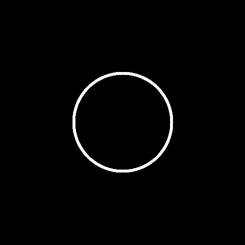
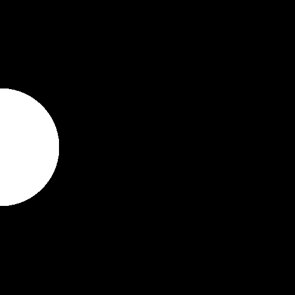
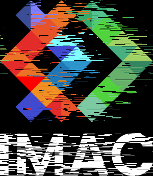
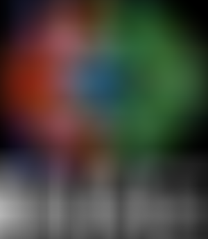
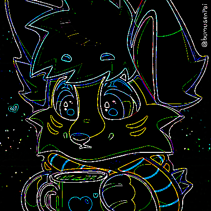
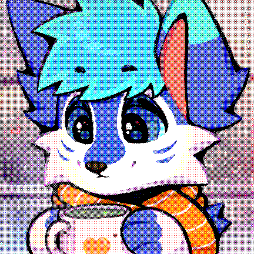
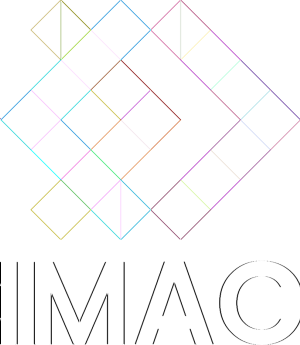
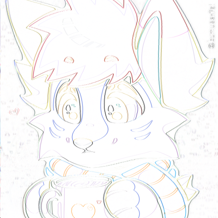
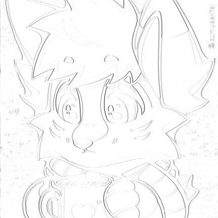

# Programmation & Algorithmie Workshop - Effets de traitement d'image (S1)

Ce projet regroupe l’ensemble des exercices réalisés lors du workshop de programmation image.

## Exercices réalisés

### ✔ Ne garder que le vert

### ✔ Echanger les canaux

### ✔ Noir & Blanc

### ✔ Négatif

### ✔ Dégradé

### ✔ Mirror

    💡 Il est possible de changer l'orentation du miroir en modifiant le paramètre de la fonction <strong>mirror</strong>, par exemple <strong>mirror(img, Mirror::Vertical)</strong> pour un miroir vertical <i>(par défaut, le miroir est horizontal)</i>.

### ✔ Image bruitée

### ✔ Rotation de 90°

### ✔ RGB Split

### ✔ Luminosité

| Plus sombre                  | Original              | Plus clair                       |
| ---------------------------- | --------------------- | -------------------------------- |
|  |  |  |

    💡 Il est possible de modifier la luminosité en changeant la valeur du paramètre <strong>mode</strong>, par exemple <strong>brightness(img, Brightness::Darker)</strong> pour une image plus sombre <i>(par défaut, l'image est éclaircie)</i>.

### ✔ Disque

    💡 Il est possible de modifier le rayon et la position du disque en changeant les paramètres de la fonction <strong>disk</strong>, par exemple <strong>disk(img, 150.f, 250, 250)</strong> pour un disque de rayon 150 centré en (250, 250) <i>(par défaut, le rayon est de 100 et le disque est centré)</i>.

### ✔ Cercle

    💡 Il est possible de modifier le rayon, l'épaisseur et la position du cercle en changeant les paramètres de la fonction <strong>circle</strong>, par exemple <strong>circle(img, 150.f, 5.f, 250, 250)</strong> pour un cercle de rayon 150, d'épaisseur 5 centré en (250, 250) <i>(par défaut, le rayon est de 100, l'épaisseur est de 3 et le cercle est centré)</i>.

### ✔ Animation

    💡 Il est possible de modifier la coordonnée Y, la durée et le nombre d'images par seconde de l'animation en changeant les paramètres de la fonction <strong>animation</strong>, par exemple <strong>animation(5, 5, 30)</strong> pour une animation de 5 secondes à 30 images par seconde avec un cercle à Y 5 <i>(par défaut, la durée est de 3 secondes à 25 images par seconde avec un cercle centré verticalement)</i>.

### ✔ Rosace

    💡 Il est possible de modifier le nombre de branches de la rosace, l'épaisseur des cercles et leur rayon en changeant les paramètres de la fonction <strong>rosette</strong>, par exemple <strong>rosette(img, 12, 1, 150)</strong> pour une rosace à 12 branches avec des cercles d'épaisseur 1 et de rayon 150 <i>(par défaut, la rosace a 6 branches avec des cercles d'épaisseur 0.5 et de rayon 100)</i>.

### ✔ Mosaïque

    💡 Il est possible de modifier le nombre de tuiles (horizontalement et verticalement) en changeant le paramètre de la fonction <strong>mosaic</strong>, par exemple <strong>mosaic(img, 10)</strong> pour une mosaïque avec 10 tuiles sur chaque ligne et sur chaque colonne <i>(par défaut, le nombre de 5)</i>.

### ✔ Mosaïque miroir

### ✔ Glitch

### ✔ Tri de pixels

### ✔ Fractale de Mandelbrot

### ✔ Convolutions

    💡 Les convolutions sont des opérations de traitement d'image qui appliquent un noyau (ou filtre) à chaque pixel de l'image pour produire une nouvelle image. Chaque noyau a un effet spécifique sur l'image, comme l'identité, le flou, l'accentuation, la détection de contours ou le flou en bloc. Pour modifier l'effet voulu, il suffit de rajouter le nom dans l'enum <strong>Kernel</strong>, la matrice dans la fonction <strong>getKernel</strong> et de passer en paramètre de la fonction <strong>convolution</strong> le nom du Kernel.

| Kernel                | Aperçu                                                   |
| --------------------- | -------------------------------------------------------- |
| Identité              |              |
| Flou                  |                      |
| Accentuation          |                |
| Détection de contours |  |
| Blur Box (100x100)    |              |

## ✔ Différence de Gaussienne

### ✔ Tramage

| Tramage       | Aperçu                                        |
| ------------- | --------------------------------------------- |
| Noir et blanc |    |
| Couleur       |  |

    💡 Le tramage est une technique de traitement d'image qui consiste à réduire le nombre de couleurs d'une image tout en essayant de préserver les détails et les nuances.
    J'ai fais la version couleur et la version monochrome (possible de choisir en changeant le booléen dans la fonction <strong>dithering</strong>) pour montrer les différentes possibilités de cet effet. Le tramage utilise une matrice de Bayer 4x4 pour déterminer comment répartir les pixels noirs et blancs (ou les différentes couleurs) en fonction de leur luminosité.

### ✔ Filtre de Kuwahara

## Effets personnels !

### Pixellisation

    💡 Il est possible de modifier la taille des blocs de pixels en changeant le paramètre de la fonction <strong>pixelated</strong>, par exemple <strong>pixelated(img, 20)</strong> pour une pixelisation avec des blocs de 20 pixels <i>(par défaut, la taille des blocs est de 8 pixels)</i>.
    <strong>Effet personnel</strong> que j'ai voulu faire pour donner un aspect pixel art à l'image, en regroupant les pixels en blocs et en remplaçant chaque bloc par la couleur moyenne de ses pixels. <i>(Effet 8 bits)</i>

### Image différentielle

| Classique                                | Inky                                  | Inky Mono                                       |
| ---------------------------------------- | ------------------------------------- | ----------------------------------------------- |
|  |  |  |

    💡 L'image différentielle est un effet que j'ai vu lors de ma 3ème année de BUT Info pour un exercice en C (création de notre propre format d'image). Il calcule les différences entre chaque pixel et le pixel précédent dans l'image, ce qui peut donner un aspect de dessin au trait ou de contour à l'image. J'ai également ajouté une version avec une palette de couleurs limitée (Inky) et une version monochrome pour montrer les différentes possibilités de cet effet.

Documenté et écrit par <strong>Kellian Bredeau</strong>.

