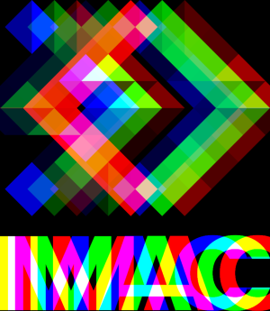

# 🐣 S1 | Prog: Workshop

## Exercices réalisés

### ✔ Ne garder que le vert

### ✔ Echanger les canaux

### ✔ Noir & Blanc

### ✔ Négatif

### ✔ Dégradé

### ✔ Mirror

    💡 Il est possible de changer l'orentation du miroir en modifiant le paramètre de la fonction <strong>mirror</strong>, par exemple <strong>mirror(img, Mirror::Vertical)</strong> pour un miroir vertical <i>(par défaut, le miroir est horizontal)</i>.

### ✔ Image bruitée

### ✔ Rotation de 90°

### ✔ RGB Split

### ✔ Luminosité

    💡 Il est possible de modifier la luminosité en changeant la valeur du paramètre <strong>mode</strong>, par exemple <strong>brightness(img, Brightness::Darker)</strong> pour une image plus sombre <i>(par défaut, l'image est éclaircie)</i>.

